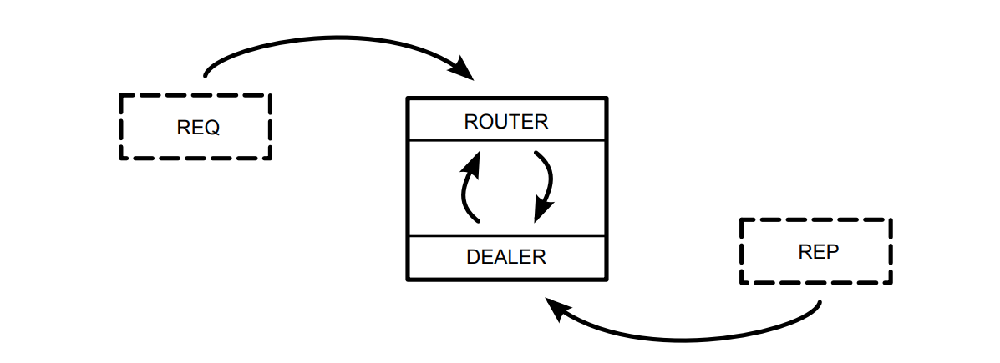

# Routing and Dealing Messages
The REQ/REP socket pair we explored makes request/reply logic easy to code
by operating sequentially. The Node.js code for a given responder will only
ever be aware of one message at a time.
For parallel message processing, ØMQ includes the more advanced socket
types ROUTER and DEALER.

### Routing Messages
You can think of a ROUTER socket as a parallel REP socket. Rather than
replying to only one message at a time, a ROUTER socket can handle many
requests simultaneously. It remembers which connection each request came
from and will route reply messages accordingly.

### Dealing Messages
If a ROUTER socket is a parallel REP socket, then a DEALER is a parallel
REQ. A DEALER socket can send multiple requests in parallel.

### Scheme

The box in the center of the figure is the Node.js program. An incoming REQ
socket connects to the ROUTER. When the REQ socket issues a request, the
ROUTER bounces it over to the DEALER. The DEALER then picks the next one
of the REP sockets connected to it (round-robin style) and forwards the request.
When the REP connection produces a reply, it follows the reverse route. The
DEALER receives the reply and bounces it back to the ROUTER. The ROUTER
looks at the message’s frames to determine its origin and sends the reply
back to the connected REQ that sent the initial request.
From the perspective of the REQ and REP sockets, nothing has changed.
Each still works on one message at a time. Meanwhile, the ROUTER/DEALER
pair can distribute (round-robin) among the REQ and REP sockets connected
on both ends.